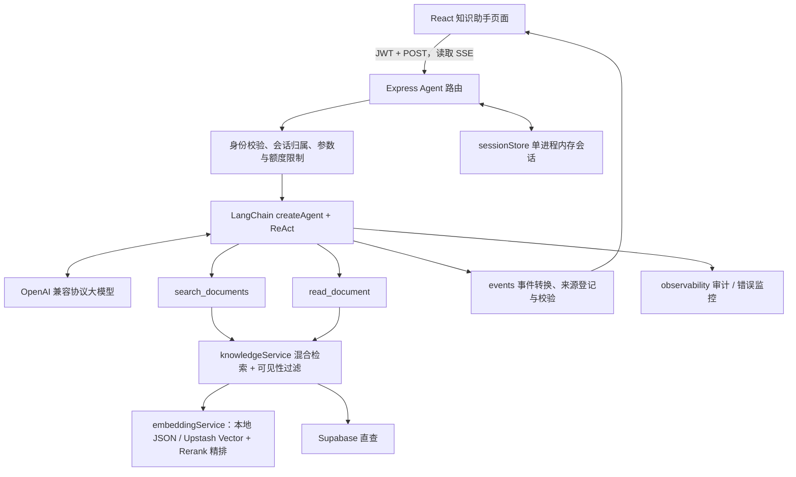

# 当前项目的功能实现

> 本文档是**第一期计划排期**的落地记录，按「排期文档规范」组织，包含目的、技术/实现方案、已落地功能清单与已知边界。更新日期：2026-09-25。

## 一、结论

第一期以「企业知识库只读助手」为核心目标，围绕 **Agent 工具闭环 → RAG 检索增强 → 数据入口 → 可观测性** 四条主线完成落地，并将数据库从内存切换为 Supabase 持久化。当前系统已具备可运行、可评估、带降级保护的只读问答能力；会话存储与向量索引仍为进程内 / 本地 JSON，云端真实模型验收尚未执行，这些已移交第二期。

---

## 二、目的

1. 在现有企业知识库中新增「知识助手」页面，用户用自然语言提问，Agent 检索文档、读取正文、组织答案并给出可点击的文档引用，支持连续追问与停止生成。
2. 首期只做**只读闭环**（搜索 + 读取 + 引用 + 追问），不引入创建/修改文档、联网浏览、代码执行等越权能力。
3. 在保证「本地可跑、切外部零改业务代码」的前提下，为向量检索、异步索引、对象存储预留可替换的驱动层。
4. 建立可量化的评估与审计体系，为后续能力扩展提供基线。

---

## 三、技术栈

| 层 | 技术 | 版本 / 说明 |
| --- | --- | --- |
| 运行时 | Node.js | `>=20.12.0 <23`，ES Modules（`"type": "module"`），后端纯 JavaScript |
| 后端框架 | Express 4 | `^4.21.2` |
| Agent | LangChain.js v1 | `langchain ^1.5.10`、`@langchain/core ^1.2.9`、`@langchain/openai ^1.5.8`、`@langchain/community ^1.1.29`、`@langchain/textsplitters ^1.0.1` |
| 参数校验 | Zod | `^4.5.4` |
| 数据库 | Supabase | `@supabase/supabase-js ^2.109.0` |
| 认证 | JWT + bcrypt | `jsonwebtoken ^9.0.2`、`bcryptjs ^2.4.3` |
| 文档解析 | mammoth | `^1.12.3`（DOCX，纯 JS 无原生依赖） |
| 文件上传 | multer | `^1.4.5-lts.1`（memoryStorage） |
| 对象存储 | Backblaze B2 | `services/storage/backblaze.js`（upload / deleteFileVersion） |
| 队列（可选） | BullMQ + ioredis | `bullmq ^6.3.8`、`ioredis ^5.11.1`（动态 import，连接失败回退内存） |
| 托管向量库（可选） | Upstash Vector / Redis | `@upstash/vector`、`@upstash/redis` |
| 前端 | React 19 + TS + Vite 7 | `antd ^6.3.1`、`zustand ^5`、`react-router-dom ^7`、`eventsource-parser ^3.1.1`、`react-markdown ^10` |

Embedding 与 Rerank 默认走 DashScope 兼容端点：Embedding 用 `text-embedding-v3`，Rerank 用 `gte-rerank-v2` / `qwen3-rerank`（支持 dashscope 与 compatible 两种接口风格）。

---

## 四、架构与各层职责

- **LangChain** 负责模型与工具间的执行循环（`createAgent` + ReAct + middleware）。
- **Express** 负责鉴权、会话、参数与额度限制、SSE 传输。
- **React** 负责交互与流式渲染。
- 模型凭据只保存在 `server/.env`，不暴露到浏览器 `VITE_*`。

---

## 五、已完成功能清单（按排期）

### 阶段一~四：知识助手只读闭环

- **模型与环境**：锁定 LangChain 1.5.10 / core 1.2.9 / openai 1.5.8；真实 SDK 通过本机兼容协议服务验证工具调用、流式与取消。
- **后端只读闭环**：`knowledgeService.js` 只读知识服务 + 两个工具 `search_documents` / `read_document` + 调用/内容预算 + 来源校验 + 会话隔离 + 全部 Agent 接口。
- **前端联调**：`/agent` 页面、会话管理、SSE 流式、来源跳转、停止/重试、账号清理。
- **可靠性**：流解析测试、类型检查与生产构建通过；SSE 事件白名单 `start / tool_start / tool_end / token / sources / done / error`。

### P0：基线与可靠性

- **P0-1 评估体系**：`server/scripts/retrieval-evaluate.js`（离线检索评估：Recall@K / MRR / falseHitRate / 延迟）；`server/scripts/agent-evaluate.js`（引用正确率 / 空回答率 / 失败率 / Token 用量）。
- **P0-2 检索配置修正**：`config.rag.topK`（RAG_TOP_K 默认 5、上限 10）与 `recallTopK`（RAG_RECALL_TOP_K 默认 20）独立；向量分改用余弦 `r.score`。
- **P0-3 索引版本与异步队列**：`INDEX_FORMAT_VERSION=2` + 版本指纹；`services/indexQueue.js` 异步索引队列（状态机 pending→processing→done / retrying / failed / waiting，指数退避，同文档合并），`createIndexQueue(deps)` 支持依赖注入。
- **P0-4 权限边界 / 审计 / 错误监控**：`services/observability.js`（`audit()` JSONL、`recordError / errorMetrics / runtimeStatus`）、`routes/observability.js`（admin only 的 `/metrics`、`/index-jobs`）。

### P1：RAG 质量与数据入口

- **P1-1 文档解析与上传**：`services/documentParser.js`（文件头 / ZIP / NUL 嗅探，支持 `.md / .markdown / .txt / .docx`）；`POST /documents/upload`、`GET /documents/index-jobs/:docId`、`POST /documents/index-jobs/:docId/retry`。
- **P1-2 Rerank 精排**：`services/rerankService.js`（dashscope 与 compatible 两种风格，失败/超时自动回退融合排序，默认关闭）。
- **P1-3 前端上传入口**：`src/pages/document/UploadDocumentModal.tsx`（拖拽上传、分类、标签、草稿/发布开关、索引入队提示）。

### 数据库持久化

- `db/index.js` 现为**纯 Supabase 直查**（`db/supabase.js` 为真实实现，`db/hosted.js` / `db/adapter.js` 为 stub），用户、文档等业务数据不再因重启丢失。

### 对象存储（Backblaze B2）

- `services/storage/backblaze.js` 已实现 `upload` / `deleteFileVersion`，并接入 `routes/documents.js` 的上传 / 删除流程。

### 可选外部驱动

- **向量存储**：`services/vectorStore/index.js` 按 `config.vector.store` 路由，`upstash.js` 为托管驱动；本地 JSON 逻辑内联在 `embeddingService.js`。
- **队列**：`services/indexQueue.js` 的 BullMQ 路径完整（Queue / Worker concurrency:1 / 指数退避 / `jobId = doc-${id}` 去重 / 审计），连接失败回退内存队列。
- **Upstash 连接状态**：Upstash Vector / Redis 已配置并连接，`VECTOR_STORE=upstash`、`INDEX_QUEUE_DRIVER=bullmq` 路径已连通；尚未做 namespace 隔离（按知识库/租户区分索引与缓存 key）。

---

## 六、关键设计约束

- **只读边界**：首期 Agent 对所有角色统一只读取 `published` 文档，草稿不进入模型；搜索在排序前完成可见性过滤，读取时再次校验。
- **提示词不能代替鉴权**：工具白名单、权限、步数限制由代码强制；前端不传 system 消息、工具定义、模型配置或用户身份字段。
- **预算限制**：输入上限、单轮工具/模型调用次数、超时、输出 token 均有配置上限；来源引用只能来自已登记的工具返回来源，最终链接由代码构造。
- **会话仍为单进程内存**：`sessionStore.js` 不保证重启恢复与多实例一致性（已移交第二期）。
- **降级保护**：RAG 未启用或向量库不可用时自动回退关键词检索；Rerank / embedding 失败仅记日志，不阻断服务。

---

## 七、验收与测试

- 后端 `node --test` 全套 **43 个用例全部通过**（改造前基线 17 个 + 本次新增 26 个）。
- 新增测试覆盖：索引队列（8）、文档解析（9）、Rerank 服务（5）、上传路由（6）。
- 前端 `tsc --noEmit` 零错误，生产构建通过。
- 真实云端模型（通义千问）验收与人工语义评审**尚未执行**（待配置 `server/.env`）。

---

## 八、已知边界（移交第二期）

以下事项本期未做，已移交「第二期计划排期」：

1. 会话存储持久化、向量索引持久化与 namespace 隔离。
2. Backblaze B2 的 `list` / `download` 接口与真实凭证闭环验证。
3. 三大能力演进（ReAct 推理可见 / LLM Wiki / Agent 长期记忆）。
4. 现有 HTTP 接口的权限补齐、生产 JWT / CORS、真实模型验收。
5. 高级能力（HITL / MCP / Plan-and-Execute / Supervisor / 语义缓存 / 长期记忆）。

详见 [第二期计划排期](第二期计划排期.md)。
